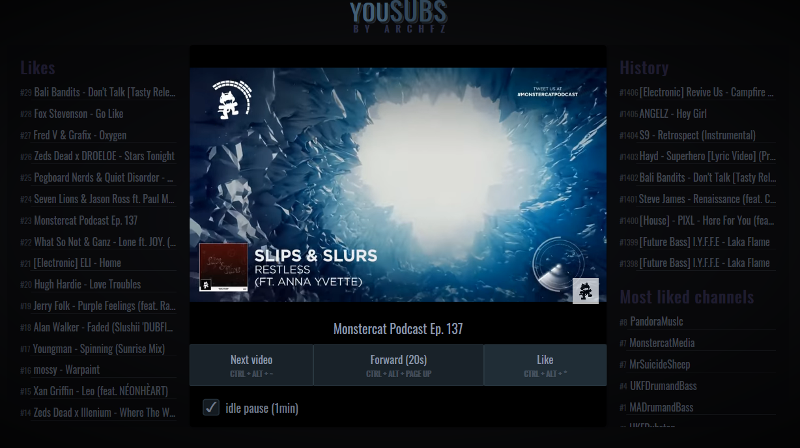

# YouSubs

Yousubs is here to make it easier going through all the youtube
subscription notification emails. Reduce all those click to just
a setup and global shortcuts. Best suited for music.

## Legend

- [Installation](#Installation)
- [Benefits](#benefits)
- [Usage](#usage)

## Installation

xserver-xorg-dev libxext-dev libxss-dev xscreensaver

1. Install node if you don't already have it [https://nodejs.org/en/](https://nodejs.org/en/)
2. Install yousubs by running in a shell ``npm install -g yousubs``

## Benefits

- Loads and plays youtube emails from your mail account.
- Cleans emails that you listened to.
- Adds global shortcuts for liking, skipping and forwarding.
- Is usable while doing other tasks, like gaming.
- Keeps history of played tracks.
- Optional IDLE pause so that you don't miss any tracks.

## Usage

1. Open a shell and run ``yousubs``. This will start a server
and open the application in your primary browser.
2. Create an account on the opened page, login and enjoy.
